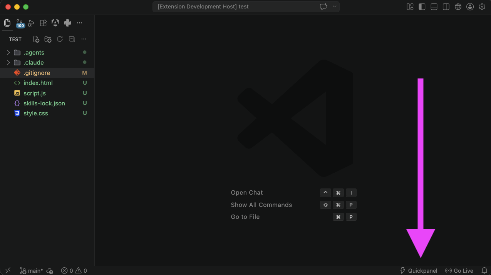
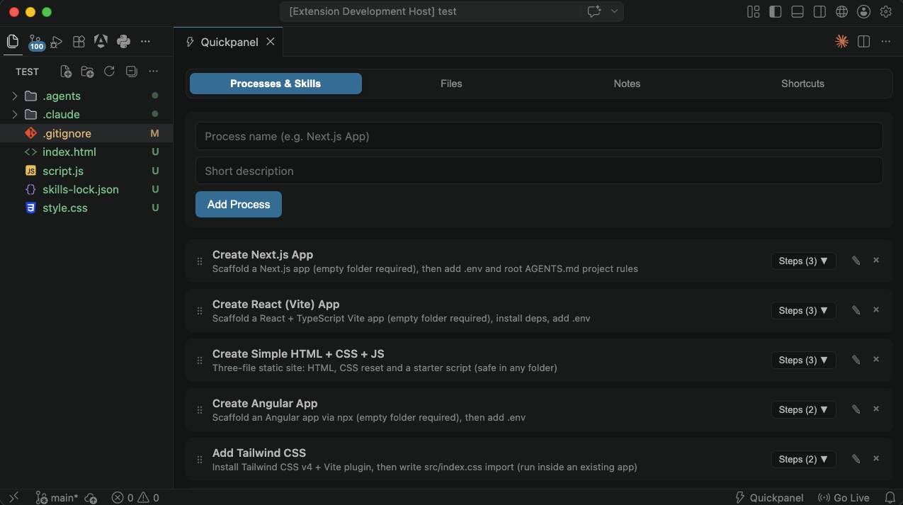

# ⚡ Quickpanel

**Your personal command center inside VS Code.**

Quickpanel gives you instant access to multi-step processes, file templates, notes and shortcuts — without ever leaving your editor.

---

### ✨ Features

- **4 Modern Tabs**
  - ⚙️ **Processes & Skills** – Run multi-step workflows (commands + file creation)
  - 📄 **Files** – Create files from templates with one click
  - 📝 **Notes** – Write and keep rich markdown notes right inside VS Code
  - ⌨️ **Shortcuts** – Save and quickly access your most used keybindings & commands

- Full **drag & drop** reordering of items and process steps
- Custom confirm dialogs
- Everything is **persisted** across VS Code sessions
- Clean and modern UI with a pill-segmented tab control

---

### 🚀 How to use

1. Click the **⚡ Quickpanel** status bar item (bottom right)
2. Or run the command: `Quickpanel: Open`
3. Start adding your own processes, file templates, notes or shortcuts

---

### 📦 Pre-loaded Defaults

On first install you get useful starter content:

- Popular processes:
  - Create Next.js App
  - Create React (Vite) App
  - Create Simple HTML + CSS + JS
  - Create Angular App
  - Add Tailwind CSS
  - Create Clean Empty Project
- Agent Skills:
  - Add React/Next.js Best Practices Skill
  - Add Supabase Postgres Best Practices Skill
- Ready-to-use file templates (`.env`, `.gitignore`, `AGENTS.md`, `README.md`)
- One example shortcut (Format Document)

### AGENTS.md vs Skills

These are **two different** agent-context systems:

| | **AGENTS.md** (repo root) | **Skills** (`.agents/skills/…`) |
|--|--|--|
| Created by | Quickpanel file steps / templates | `npx skills add …` |
| Main file | One project-wide rules doc | Per-skill `SKILL.md` |
| Used by agents | Always (passive rules) | On demand when relevant |

Installing a skill does **not** create or replace root `AGENTS.md`, and adding a second skill should not remove the first — skills live under `.agents/skills/<name>/`.

Each command step (and each Run All) opens a **new** VS Code terminal so previous output stays visible.

---

### 🛠️ Requirements

- Visual Studio Code `1.85.0` or higher

---

### 📝 Feedback & Issues

Found a bug or have a feature request?  
Open an issue on [GitHub](https://github.com/lvfranek/quickpanel-vscode-extension).

---

**Enjoy a faster workflow.** ⚡